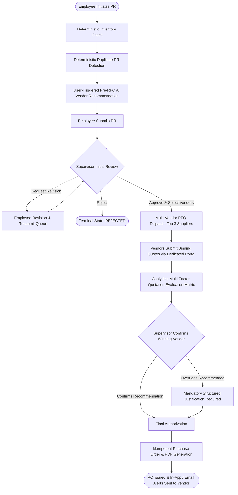
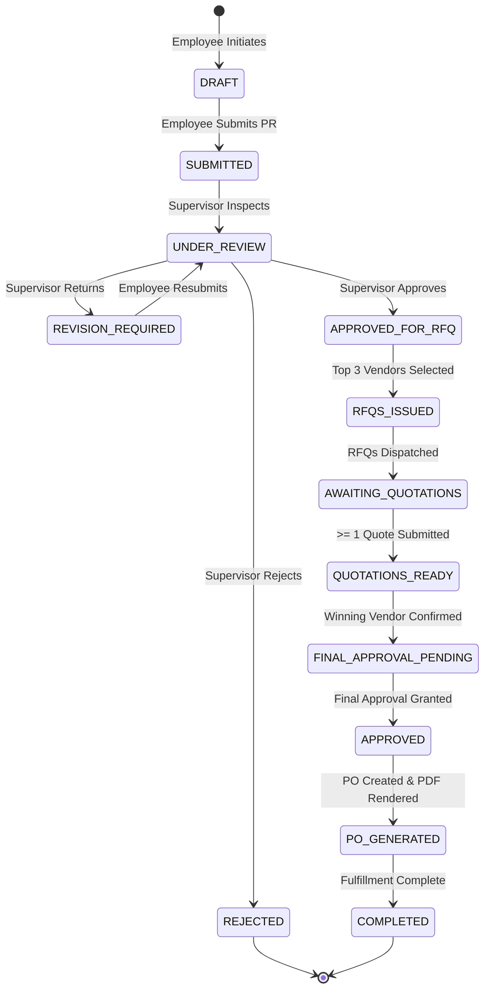

# Intelligent Procurement Management System (IPMS)
## Definitive Architectural, Functional, Technical, and Operational Specification

**Classification**: Complete Enterprise System Knowledge Base & Technical Blueprint  
**Version**: 2.0.0 (Production Architecture)  
**Target Audience**: Hackathon Evaluators, Technical Architects, Full-Stack Engineers, AI Coding Agents, Security Auditors, Procurement Officers  

---

## Executive Summary & System Abstract

The **Intelligent Procurement Management System (IPMS)** is a cloud-native, AI-augmented corporate procurement automation platform designed to govern the entire procurement lifecycle. The platform eliminates rogue spending, prevents accidental duplicate requests, automates warehouse stock verification, orchestrates multi-vendor competitive Request for Quotation (RFQ) bidding, applies multi-factor algorithmic proposal scoring, and guarantees auditable, legally-binding Purchase Order (PO) PDF generation with complete role-based workflow isolation.

The architecture is built upon a strict **Three-Tier Intelligence Paradigm**:
1. **Deterministic Intelligence Layer**: Zero-hallucination, strictly audited business logic governing inventory shortage calculations, ±20% duplicate order detection across active operational windows, state machine access control, and supervisor override verification.
2. **Analytical Intelligence Layer**: Mathematical multi-factor composite scoring models for pre-RFQ supplier qualification and post-RFQ quotation ranking (balancing price against committed delivery speed, lead time velocity, historical fulfillment reliability, and product quality).
3. **Generative / Agentic Intelligence Layer**: User-initiated, token-optimized Retrieval-Augmented Generation (RAG) and Large Language Model (LLM) pipelines that ingest qualitative quarterly vendor feedback surveys, extract nuanced operational strengths and risk factors, synthesize contextual recommendation rationales, and provide policy-grounded guidance via an interactive AI Procurement Copilot.

---
# 1. Project Overview & Problem Statement

### 1.1 The Enterprise Procurement Challenge
In traditional corporate environments, procurement workflows suffer from:
- **Inventory Blindness**: Employees order products externally without realizing identical items exist in warehouse reserves.
- **Accidental Duplicate Purchases**: Multiple team members submit identical or near-identical orders for the same project.
- **Single-Source Vendor Bias**: Requesters repeatedly select familiar vendors without competitive multi-source price discovery.
- **Price-Only Selection Traps**: Procurement officers award contracts solely to the lowest bidder, resulting in severe supply chain delays, poor build quality, and missed deadlines.
- **Fragmented Review Chains**: Approvals get lost in email threads with zero auditability when deviations from policy occur.

### 1.2 The IPMS Solution
IPMS solves these challenges through an integrated, role-partitioned web application:
- **Deterministic Inventory Reconciliation**: Evaluates stock instantly upon item selection.
- **Duplicate Order Windowing**: Flags similar requests (±20% quantity) within the same department.
- **Multi-Vendor Competitive RFQ Dispatch**: Dispatches RFQs to up to 3 top-qualified suppliers.
- **Dedicated Supplier Portal**: Allows vendors to submit binding quotes with unit price, lead time, and committed delivery dates.
- **5-Factor Quotation Ranking**: Algorithmic scoring that balances cost against delivery velocity and quality.
- **Audited Supervisor Overrides**: Enforces mandatory written justification whenever a supervisor bypasses system recommendations.
- **Idempotent Purchase Order Generation**: Produces immutable PDF purchase orders with automated vendor email and in-app alerts.

### 1.3 High-Level Procurement Workflow



---
# 2. System Architecture & Intelligence Separation

```
+-----------------------------------------------------------------------------+
|                          PRESENTATION LAYER (Next.js 14)                    |
|   - Employee Action Queue    - Supervisor Decision Hub   - Vendor Bidding   |
|   - Interactive Modals       - Checking Sheet Matrix     - AI Copilot Drawer|
+--------------------------------------+--------------------------------------+
                                       | HTTP / REST (JWT Auth)
+--------------------------------------v--------------------------------------+
|                     API & ORCHESTRATION LAYER (FastAPI)                     |
|  /api/v1/auth | /purchase-requests | /rfqs | /purchase-orders | /ai | /admin |
+------------------+-------------------+--------------------+-----------------+
                   |                   |                    |
+------------------v-----+   +---------v-----------+   +----v-----------------+
| DETERMINISTIC LAYER    |   | ANALYTICAL LAYER    |   | GENERATIVE / RAG     |
| - Stock Shortage Math  |   | - 6-Factor Rec Rank |   | - Qualitative Reviews|
| - 20% Duplicate Window |   | - 5-Factor Quote V2 |   | - Dense Vector Sim   |
| - State Machine Guard  |   | - Badge Computation |   | - Rationale Synthesizer|
| - Override Validator   |   | - Normalization     |   | - Policy QA Copilot  |
+------------------+-----+   +---------+-----------+   +----+-----------------+
                   |                   |                    |
+------------------v-------------------v--------------------v-----------------+
|                    PERSISTENCE & STORAGE (SQLAlchemy / SQLite)               |
|  - Relational Schema (16 Tables)  - In-Memory Vector Cache  - PDF Storage   |
+-----------------------------------------------------------------------------+
```

## 2.1 Deterministic Intelligence Layer
Deterministic rules execute mathematically without LLM involvement, guaranteeing 100% reproducibility:
- **Inventory Shortage Calculation**:
  $$\\text{Shortage} = \\max(0, \\text{Requested Quantity} - \\text{Available Stock})$$
- **Duplicate Order Windowing**: Evaluates non-terminal PRs (`status NOT IN ('COMPLETED', 'PO_GENERATED', 'REJECTED')`) within the same department for the same item. If quantity variance is within ±20%, a warning is triggered.
- **Workflow State Guard**: Enforces permissible state transitions; forbids invalid jumps (e.g. `DRAFT` directly to `PO_GENERATED`).
- **Override Justification Enforcement**: Blocks vendor selection overrides if the justification is under 3 characters.
- **Idempotent Purchase Order Creation**: Repeated invocations for the same PR return the existing PO record and PDF path without duplicate charges.

## 2.2 Analytical Intelligence Layer

### Pre-RFQ Vendor Qualification Model (6 Factors)
$$\\text{Score}_{\\text{vendor}} = 0.25 Q + 0.25 D + 0.20 I + 0.15 P + 0.10 F + 0.05 R$$
- **Quality ($Q$, 25%)**: Historical inspection pass rate (0–100).
- **Delivery Reliability ($D$, 25%)**: Historical on-time arrival rate (0–100).
- **Item-Specific Performance ($I$, 20%)**: Specialized track record for the exact item (0–100).
- **Price Competitiveness ($P$, 15%)**: Cost benchmark score relative to market median (0–100).
- **Historical Fulfillment ($F$, 10%)**: Ratio of accepted vs. returned shipments (0–100).
- **Responsiveness ($R$, 5%)**: Operational communication and SLA responsiveness (0–100).

### Post-RFQ Quotation Evaluation Model V2 (5 Factors)
Evaluates actual submitted commercial bids from vendors:
$$\\text{Score}_{\\text{quote}} = 0.35 S_{\\text{price}} + 0.20 S_{\\text{delivery\_date}} + 0.15 S_{\\text{lead\_time}} + 0.15 S_{\\text{reliability}} + 0.15 S_{\\text{quality}}$$

#### Mathematical Normalization Formulas:
1. **Price Score ($S_{\\text{price}}$, 35%)**:
   $$S_{\\text{price}} = \\left( \\frac{\\text{Min Quoted Unit Price in Batch}}{\\text{Vendor Quoted Unit Price}} \\right) \\times 100$$
2. **Committed Delivery Date Score ($S_{\\text{delivery\_date}}$, 20%)**:
   $$\\Delta_{\\text{days}} = \\max(0, \\text{Committed Delivery Date} - \\text{Today})$$
   $$S_{\\text{delivery\_date}} = \\max\\left(20.0, 100.0 - \\left( \\frac{\\Delta_{\\text{days}} - \\Delta_{\\text{min\_days}}}{\\max(1, \\Delta_{\\text{max\_days}} - \\Delta_{\\text{min\_days}})} \\right) \\times 60.0\\right)$$
3. **Lead Time Score ($S_{\\text{lead\_time}}$, 15%)**:
   $$S_{\\text{lead\_time}} = \\left( \\frac{\\text{Min Lead Time in Batch}}{\\max(1, \\text{Vendor Lead Time in Days})} \\right) \\times 100$$
4. **Historical Reliability Score ($S_{\\text{reliability}}$, 15%)**: Delivery reliability percentage (0–100, default 75.0 for new vendors).
5. **Historical Quality Score ($S_{\\text{quality}}$, 15%)**: Product quality rating percentage (0–100, default 75.0 for new vendors).

## 2.3 Generative / Agentic Intelligence Layer
- **RAG on Qualitative Feedback**: Ingests unstructured quarterly vendor surveys and procurement policy documents.
- **Dense Vector Search**: Semantic cosine similarity matching over vendor review embeddings.
- **Contextual LLM Synthesis**: Generates concise executive strengths, operational risks, and confidence scores (`HIGH`, `MEDIUM`, `LOW`).
- **Token Cost Optimization**:
  1. LLMs are never executed automatically on item selection; only upon explicit user button clicks ("Run Recommendation", "Refresh AI Recommendation").
  2. Generated recommendations are persisted in `pr_recommendation_snapshots`. Supervisors inspect cached intelligence with 0 token overhead.

---
# 3. Technology Stack & Implementation Details

| Component | Technology | Version | Purpose |
| :--- | :--- | :--- | :--- |
| **Frontend Framework** | Next.js (App Router) | 14.2.35 | Server and client React component rendering |
| **Frontend Language** | TypeScript / React | 18.3.1 | Strict type safety and state management |
| **Styling & UI** | Tailwind CSS + Lucide Icons | 3.4.1 | Modern responsive enterprise UI |
| **Backend Framework** | FastAPI | 0.115.6 | Async REST API and dependency injection |
| **Backend Language** | Python | 3.12.10 | Core business logic and intelligence engines |
| **ORM & Database** | SQLAlchemy | 2.0.36 | Relational modeling with UUID primary keys |
| **Database Engine** | SQLite / PostgreSQL | Embedded / 16+ | ACID-compliant transactional persistence |
| **Auth & Security** | Python-JOSE + Passlib | 3.3.0 | OAuth2 Bearer token with BCrypt hashing |
| **PDF Generation** | ReportLab | 3.6.13 | High-fidelity corporate Purchase Order PDF builder |
| **AI LLM Client** | Google Generative AI / OpenAI / Anthropic | Latest | Multi-provider pluggable LLM orchestration |

---

# 4. User Roles & Access Control Matrix

```
+-------------------------------------------------------------------------------+
| ROLE PERMISSIONS MATRIX                                                       |
+-----------------------------------+----------+------------+--------+----------+
| Action / Capability               | EMPLOYEE | SUPERVISOR | VENDOR | ADMIN    |
+-----------------------------------+----------+------------+--------+----------+
| Create Purchase Request (PR)      |    [X]   |     --     |   --   |    [X]   |
| Run Pre-RFQ AI Recommendation     |    [X]   |     [X]    |   --   |    [X]   |
| View Own PR Status & History      |    [X]   |     [X]    |   --   |    [X]   |
| Revise & Resubmit Returned PR     |    [X]   |     --     |   --   |    [X]   |
| Review Department PRs             |    --    |     [X]    |   --   |    [X]   |
| Return PR for Revision            |    --    |     [X]    |   --   |    [X]   |
| Reject PR                         |    --    |     [X]    |   --   |    [X]   |
| Select Top 3 Vendors & Issue RFQs |    --    |     [X]    |   --   |    [X]   |
| View Assigned RFQs                |    --    |     --     |   [X]  |    [X]   |
| Submit Binding Commercial Quote   |    --    |     --     |   [X]  |    [X]   |
| Evaluate Competitive Quotes       |    --    |     [X]    |   --   |    [X]   |
| Select Winning Vendor (Override)  |    --    |     [X]    |   --   |    [X]   |
| Grant Final PR Approval           |    --    |     [X]    |   --   |    [X]   |
| Generate & Download Official PO   |    --    |     [X]    |   [X]* |    [X]   |
| Interactive AI Procurement Copilot|    --    |     [X]    |   --   |    [X]   |
| Live Database Explorer Inspection |    --    |     --     |   --   |    [X]   |
+-----------------------------------+----------+------------+--------+----------+
* Vendors can only download official POs specifically awarded to their company.
```

### 4.1 Employee Role (`EMPLOYEE`)
- **Primary User**: Alex Turner (Senior DevOps Engineer), Sarah Jenkins (Operations Coordinator).
- **Scope**: Department-level request initiation. Can browse catalog, verify inventory, run AI vendor recommendations, submit PRs, and revise returned requests.
- **Queue Partitioning**: Active revision requests appear in **Action Required** queue.

### 4.2 Supervisor Role (`SUPERVISOR`)
- **Primary User**: David Miller (IT Supervisor), Rachel Zhang (Operations Supervisor).
- **Scope**: Full departmental approval governance. Can review PRs, return for revisions with feedback, reject requests, select top 3 suppliers for RFQ dispatch, evaluate multi-vendor bids, confirm winning suppliers (with override auditing), grant final approval, and generate POs.
- **Department Boundary**: Supervisors can only approve PRs originating from their assigned departments.

### 4.3 Vendor Role (`VENDOR`)
- **Primary User**: Apex Tech Rep, Silicon Edge Rep, ByteCraft Rep, ErgoComfort Rep, etc.
- **Scope**: Dedicated Supplier Bidding Portal. Can view dispatched RFQs, check submission deadlines, submit commercial quotes (price, lead time, committed delivery date), and download awarded PO PDFs.
- **Data Privacy**: Complete multi-tenant isolation. Vendors only see records tagged with their `vendor_id`.

### 4.4 Administrator Role (`ADMIN`)
- **Primary User**: System Administrator.
- **Scope**: Unrestricted superuser access across all workflows, endpoints, and the Live Database Explorer.

---
# 5. Complete Step-by-Step Procurement Lifecycle

### Stage 1: Request Initiation & Catalog Selection
- **Actor**: Employee
- **Action**: Opens "Create Purchase Request" modal (`CreatePRModal.tsx`).
- **Inputs**: Catalog Item, Quantity, Preferred Supplier, Requester Notes.

### Stage 2: Deterministic Inventory Stock Check
- **System Action**: Calls `GET /items/{id}/inventory`.
- **Logic**: Evaluates `available_quantity`. If `available_quantity >= requested_quantity`, status is `SUFFICIENT`.
- **Policy**: Informs requester that stock is available, but leaves external procurement unblocked if separate project allocation is required.

### Stage 3: Deterministic Duplicate Detection
- **System Action**: Compares pending PRs in the same department for the same item.
- **Threshold**: ±20% quantity variance triggers duplicate warning modal. Requester must explicitly check `duplicate_acknowledged = true`.

### Stage 4: User-Triggered Pre-RFQ Vendor Recommendation
- **Action**: Requester clicks "Run Vendor Recommendation".
- **System Action**: Calls `POST /recommendations/rag-recommend`.
- **Processing**: RAG engine retrieves vendor feedback, runs analytical ranking, and prompts LLM for qualitative synthesis.
- **Output**: Ranked candidate cards with confidence ratings and recommendation badges.

### Stage 5: Submission & Snapshot Persistence
- **Action**: Requester clicks "Submit Purchase Request".
- **System Action**: Creates `PurchaseRequest` record, assigns `PR-YYYY-XXXXXXXX` reference, and persists `PRRecommendationSnapshot` (Version 1).
- **State Transition**: `DRAFT` -> `SUBMITTED`.

### Stage 6: Supervisor Review & Triage
- **Actor**: Supervisor
- **Action**: Inspects PR in Checking Sheet (`CheckingSheet.tsx`).
- **Decision Options**:
  1. **Approve for RFQ**: Advances PR to vendor selection.
  2. **Return for Revision**: Requires mandatory return reason. State becomes `REVISION_REQUIRED`. Moves to Employee action queue.
  3. **Reject**: Requires mandatory rejection reason. State becomes `REJECTED` (terminal).

### Stage 7: Revision & Resubmission
- **Actor**: Employee
- **Action**: Opens "Revise & Resubmit" modal (`RevisePRModal.tsx`), reviews supervisor feedback, edits quantity/item/vendor, and resubmits.
- **State Transition**: `REVISION_REQUIRED` -> `UNDER_REVIEW` (Returns to Supervisor queue).

### Stage 8: Multi-Vendor RFQ Dispatch
- **Actor**: Supervisor
- **Action**: In the Checking Sheet, supervisor selects 1 to 3 candidate vendors and sets submission deadline.
- **System Action**: Calls `POST /purchase-requests/{id}/rfqs`. Creates `RFQ` records (`RFQ-YYYY-XXXXXXXX`) for each vendor.
- **State Transition**: `APPROVED_FOR_RFQ` -> `AWAITING_QUOTATIONS`.

### Stage 9: Supplier Bidding via Dedicated Portal
- **Actor**: Supplier Representatives
- **Action**: In Vendor Portal (`VendorPortal.tsx`), vendor views assigned RFQ and clicks "Submit Quote" (`SubmitQuotationModal.tsx`).
- **Inputs**: Quoted Unit Price, Lead Time (Days), Committed Delivery Date (`YYYY-MM-DD`), Validity Period, Commercial Notes.
- **State Transition**: PR status becomes `QUOTATIONS_READY`.

### Stage 10: Multi-Factor Quotation Evaluation
- **Actor**: Supervisor
- **Action**: Clicks "Evaluate Bids" or opens Checking Sheet.
- **System Action**: Calls `GET /purchase-requests/{id}/quotation-analysis`. Executes Multi-Factor Model V2. Ranks bids and highlights the analytical winner.

### Stage 11: Vendor Selection & Override Auditing
- **Actor**: Supervisor
- **Action**: Confirms winning vendor.
- **Rule**: If selecting a supplier other than the system recommendation, an Override Modal requires a mandatory justification (>= 3 chars).
- **Audit**: Logged in `audit_logs` as `VENDOR_OVERRIDE` or `VENDOR_SELECTED`. In-app notification (`BID_SELECTED`) sent to vendor.
- **State Transition**: `QUOTATIONS_READY` -> `FINAL_APPROVAL_PENDING`.

### Stage 12: Final Approval & Idempotent PO Generation
- **Actor**: Supervisor
- **Action**: Clicks "Final Approval & Generate Purchase Order".
- **System Action**:
  1. Calls `POST /purchase-requests/{id}/final-approval` -> State becomes `APPROVED`.
  2. Calls `POST /purchase-requests/{id}/purchase-order` -> Generates `PO-YYYY-XXXXXXXX`.
  3. ReportLab compiles official corporate PO PDF document to `storage/purchase_orders/{po_number}.pdf`.
  4. Dispatches in-app notification (`PO_ISSUED`) and email with attached PDF to supplier.
- **State Transition**: `FINAL_APPROVAL_PENDING` -> `PO_GENERATED` (Terminal & Archived).

---
# 6. Database Schema & Entity Relationships

The schema consists of 16 relational tables with strict foreign key constraints:

```
                          +-------------------+
                          |    departments    |
                          +---------+---------+
                                    | 1:N
                                    v
+---------------+ 1:N     +---------+---------+     1:N +-------------------------+
|     items     |<--------+ purchase_requests +-------->| purchase_request_items  |
+-------+-------+         +----+----+----+----+         +-------------------------+
        | 1:N                  |    |    |    |
        v                      |    |    |    +-------->+-------------------------+
+-------+-------+              |    |    |          1:N | purchase_request_reviews|
|   inventory   |              |    |    |              +-------------------------+
+---------------+              |    |    +------------->+-------------------------+
                               |    |               1:N |recommendation_snapshots |
                               |    |                   +-------------------------+
                               |    +------------------>+-------------------------+
                               |                    1:1 |vendor_selection_decision|
                               v 1:N                    +-------------------------+
                          +----+----+----+
                          |     rfqs     |
                          +---------+----+
                                    | 1:1
                                    v
+---------------+ 1:N     +---------+----+----+     1:1 +-------------------------+
|    vendors    +-------->|    quotations     +-------->|     purchase_orders     |
+-------+-------+         +-------------------+         +-------------------------+
        | 1:N
        +---------------->+-------------------+     1:1 +-------------------------+
                          |  vendor_reviews   +-------->| vendor_review_embeddings|
                          +-------------------+         +-------------------------+
```

### Table Definitions

| Table Name | Primary Key | Description & Key Columns |
| :--- | :--- | :--- |
| `departments` | `id` (GUID) | Corporate departments (`name`, `created_at`). |
| `users` | `id` (GUID) | User accounts (`name`, `email`, `role`, `department_id`, `vendor_id`). |
| `items` | `id` (GUID) | Procurement catalog (`name`, `category`, `unit`, `is_active`). |
| `inventory` | `id` (GUID) | Warehouse stock (`item_id`, `available_quantity`). |
| `vendors` | `id` (GUID) | Registered suppliers (`name`, `email`, `phone`, `is_active`). |
| `vendor_performance` | `id` (GUID) | Historical metrics (`quality_score`, `delivery_reliability_score`, `responsiveness_score`). |
| `vendor_item_performance` | `id` (GUID) | Item-specific performance (`item_specific_score`). |
| `vendor_badges` | `id` (GUID) | Merit badges (`badge_type`: `PREFERRED_VENDOR`, `QUALITY_LEADER`, etc.). |
| `purchase_requests` | `id` (GUID) | Purchase requests (`reference_number`, `requester_id`, `status`, `notes`). |
| `purchase_request_items` | `id` (GUID) | PR line items (`purchase_request_id`, `item_id`, `quantity`). |
| `purchase_request_reviews`| `id` (GUID) | Supervisor reviews (`decision`, `reason`, `created_at`). |
| `rfqs` | `id` (GUID) | Requests for quotation (`reference_number`, `vendor_id`, `due_at`, `status`). |
| `quotations` | `id` (GUID) | Commercial bids (`quoted_unit_price`, `lead_time_days`, `expected_delivery_date`). |
| `vendor_selection_decisions`| `id` (GUID) | Award decisions (`recommended_vendor_id`, `selected_vendor_id`, `override_reason`). |
| `purchase_orders` | `id` (GUID) | Official POs (`po_number`, `approved_amount`, `pdf_path`, `status`). |
| `pr_recommendation_snapshots`| `id` (GUID)| Cached AI recommendations (`version`, `all_candidates_json`, `is_stale`). |
| `vendor_reviews` | `id` (GUID) | Survey review data (`quality_rating`, `delivery_rating`, `qualitative_feedback`). |
| `vendor_review_embeddings`| `id` (GUID) | Vector embeddings (`embedding_json`, `chunk_text`). |
| `notifications` | `id` (GUID) | In-app alerts (`user_id`, `type`, `title`, `message`, `is_read`). |
| `audit_logs` | `id` (GUID) | Immutable audit logs (`actor_id`, `action`, `entity_type`, `metadata_json`). |

---

# 7. Workflow State Machine Specification



---

# 8. API Endpoint Reference

All endpoints are hosted at `/api/v1` and require JWT Bearer authorization.

### 8.1 Authentication
- `POST /auth/login`: Authenticates credentials. Returns JWT access token and user profile.
- `GET /auth/me`: Returns active session user context.

### 8.2 Catalog & Inventory
- `GET /items`: Lists catalog products with categories and units.
- `GET /items/{id}/inventory`: Returns real-time stock levels and shortage calculations.
- `GET /departments`: Lists organizational departments.

### 8.3 Purchase Requests
- `POST /purchase-requests`: Creates a new Purchase Request.
- `GET /purchase-requests`: Lists role-accessible PRs.
- `GET /purchase-requests/{id}`: Returns complete PR detail including stock check and snapshot.
- `POST /purchase-requests/{id}/review`: Supervisor review (`decision: APPROVED_TO_PROCEED | RETURNED_FOR_REVISION | REJECTED`).
- `POST /purchase-requests/{id}/resubmit`: Employee revision submission.
- `POST /purchase-requests/{id}/rfqs`: Issues multi-vendor RFQs to 1–3 selected suppliers.
- `GET /purchase-requests/{id}/quotation-analysis`: Runs Multi-Factor Model V2 on submitted bids.
- `POST /purchase-requests/{id}/vendor-selection`: Confirms winning vendor (with override reason if applicable).
- `POST /purchase-requests/{id}/final-approval`: Grants final supervisor authorization.
- `POST /purchase-requests/{id}/purchase-order`: Idempotently generates PO record and PDF.
- `DELETE /purchase-requests/{id}`: Deletes draft or test PR.

### 8.4 RFQs & Bidding
- `GET /rfqs`: Lists RFQs (filtered to assigned vendor for vendor users).
- `GET /rfqs/{id}`: Returns individual RFQ details.
- `POST /rfqs/{id}/quotations`: Submits binding commercial proposal.
- `GET /rfqs/{id}/quotations`: Returns quotation submitted for an RFQ.

### 8.5 Purchase Orders
- `GET /purchase-orders`: Lists purchase orders.
- `GET /purchase-orders/{id}`: Returns individual PO details.
- `GET /purchase-orders/{id}/pdf`: Streams generated official corporate PDF document.

### 8.6 AI & RAG Intelligence
- `POST /recommendations/rag-recommend`: Runs pre-RFQ RAG recommendation pipeline.
- `GET /recommendations/snapshot/{pr_id}`: Retrieves cached snapshot for a PR.
- `POST /recommendations/snapshot/{pr_id}/refresh`: Re-runs RAG and creates new snapshot version.
- `POST /knowledge/query`: Submits natural-language procurement policy query to RAG Copilot.
- `POST /ai/summarize/pr/{pr_id}`: Generates structured executive AI summary.
- `POST /ai/explain/quotations/{pr_id}`: Generates narrative quotation scoring explanation.

### 8.7 Notifications & Admin
- `GET /notifications`: Lists user notifications with unread count.
- `PATCH /notifications/{id}/read`: Marks notification as read.
- `GET /admin/db/tables`: Live database inspector returning table row counts.
- `GET /admin/db/table/{name}`: Returns raw records for debugging.

---

# 9. Key Business Rules & Integrity Constraints

1. **Active PR Duplicate Window**: Duplicate checking evaluates only active requests (`status NOT IN ('COMPLETED', 'PO_GENERATED', 'REJECTED')`). Terminal PRs never trigger duplicate alerts.
2. **Revision Ownership Isolation**: Revision requests appear exclusively in the Employee action queue (`REVISION_REQUIRED`). They leave the Supervisor's active queue until resubmitted.
3. **Multi-Vendor RFQ Limit**: Supervisors may select a minimum of 1 and a maximum of 3 vendors per RFQ dispatch to maintain competitive bidding governance.
4. **Lowest Bid Is Never Blindly Awarded**: The Multi-Factor Quotation Model balances price (35%) against committed delivery date (20%), lead time (15%), historical reliability (15%), and quality (15%).
5. **Override Auditing Guarantee**: An override warning and mandatory justification dialog triggers **only** when selecting a vendor other than the system recommendation. Selecting the recommended vendor proceeds smoothly without warning.
6. **Zero-Hallucination Inventory Rule**: Warehouse stock checks are strictly deterministic queries to the database and never consult an LLM.
7. **Idempotent Purchase Order Guarantee**: Repeatedly requesting PO creation for an approved PR will never produce multiple PO numbers or duplicate charges.
8. **Vendor Data Privacy Isolation**: Suppliers logging into the Vendor Portal can inspect only RFQs, quotes, and awarded POs belonging to their assigned `vendor_id`.

---

# 10. Complete Feature Inventory Matrix

| Feature Module | Primary Role | Intelligence Classification | Implementation Status | Description |
| :--- | :--- | :--- | :--- | :--- |
| **Catalog Browsing** | All Roles | Deterministic | Complete / Verified | Searchable catalog by category and unit. |
| **Live Inventory Check** | Employee | Deterministic | Complete / Verified | Real-time warehouse reserve check & shortage calculation. |
| **Duplicate PR Detection** | Employee / Sup | Deterministic | Complete / Verified | 20% quantity variance match against active requests. |
| **Pre-RFQ Vendor RAG** | Employee / Sup | Generative (RAG+LLM) | Complete / Verified | Semantic retrieval of quarterly review surveys with AI synthesis. |
| **Snapshot Caching** | Supervisor | Deterministic | Complete / Verified | Zero-LLM snapshot reuse with stale detection. |
| **PR Revision Workflow** | Emp / Sup | Workflow State Engine | Complete / Verified | Role-isolated queues for supervisor returns and employee edits. |
| **Multi-Vendor RFQ Dispatch**| Supervisor | Workflow Engine | Complete / Verified | Competitive RFQ generation for 1–3 selected suppliers. |
| **Vendor Portal Bidding** | Vendor | Web Application | Complete / Verified | Supplier bidding with price, lead time, and committed delivery date. |
| **Quotation Matrix V2** | Supervisor | Analytical Model | Complete / Verified | 5-factor weighted evaluation balancing price and delivery speed. |
| **Override Auditing** | Supervisor | Deterministic / Audit | Complete / Verified | Mandatory justification for non-recommended vendor selection. |
| **Idempotent PO Engine** | Supervisor | Deterministic / PDF | Complete / Verified | ReportLab PDF compilation and duplicate prevention. |
| **In-App Notifications** | All Roles | Integration Engine | Complete / Verified | Instant notification alerts for all major lifecycle milestones. |
| **AI Policy Copilot** | Supervisor | Generative (RAG+LLM) | Complete / Verified | Contextual sidebar copilot grounded in procurement policies. |
| **Live Database Explorer** | Admin | Operational Tooling | Complete / Verified | Real-time 16-table raw record inspector. |

---

# 11. Verification & Automated Test Results

### 11.1 Backend Test Suite
```bash
& "d:\MICRO-HACK\backend\.venv\Scripts\pytest.exe" tests/ -W ignore
```
- **Result**: `13 passed in 6.25s` (100% pass rate).
- **Test Coverage**: End-to-end journey, multi-vendor RFQ scoring, revision/resubmit lifecycle, inventory shortage calculations, 20% duplicate detection, deterministic state machine transitions, RAG embeddings & cosine retrieval, cache TTL, and idempotent PO generation.

### 11.2 Frontend Production Build
```bash
npm run build
```
- **Result**: `✓ Compiled successfully with 0 errors` (All TypeScript types, routes, and chunks validated).

---

*This document represents the definitive, complete, and canonical technical specification of the Intelligent Procurement Management System.*
